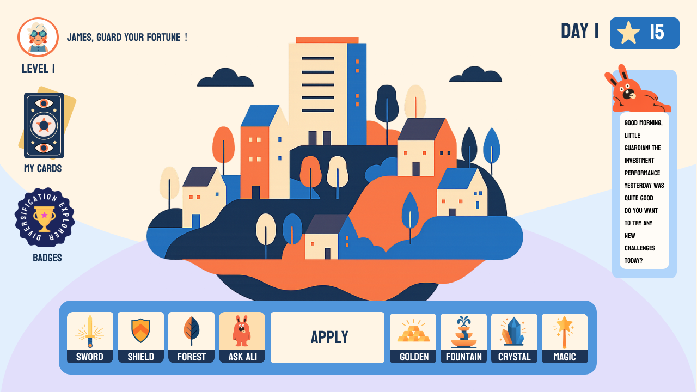
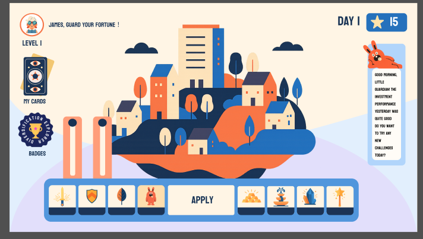

# Legacy Guardians – Wealth Adventure

7-Day Hackathon Product Requirements Document (PRD)

---

## 🎯 1. Product Goals

### Background

Teens often lack engaging tools to learn financial literacy. Traditional investment education is too adult-oriented and abstract.We need a **zero-risk, controllable, immersive simulation game** to help teens intuitively understand:

- Diversification
- Risk vs. return
- Portfolio thinking
- Market volatility

### Product Positioning

**Legacy Guardians – Family Wealth Academy**

- **Users**: Teenagers (12–18) – players
- **Customers**: Parents – decision makers, trust & payers
- **Positioning**: Family financial literacy education game (education-first, gameplay as the wrapper)

---

## 🏗️ 2. Core Feature Requirements

### Game Loop (MVP)

1. Draw a **Mission Card** (e.g., "Diversify portfolio").
2. Adjust asset weights (sliders/cards, total = 100%).
3. Draw a **Market Event Card** (e.g., "Sun / Storm / Mist").
4. Trigger simulated results → portfolio up/down.
5. AI Companion feedback (Encourage → Suggest → Ask).
6. Settlement: stars, badges, Skyland restoration progress.

---

## 🌍 3. User Interfaces (Screenshots)

### Main Screen – Skyland Island

Players see their Skyland, stars, badges, and AI Companion.

---

### Slider Screen – Asset Allocation

Players adjust asset weights (e.g., Sword = Tech, Shield = Bonds).

---

### Mission & Market Cards

Players draw **Mission Card** (goal) and **Market Event Card** (market condition).

---

## 👤 4. User Flows

### Teen Flow

1. Enter game → greeted by AI companion
2. Draw **Mission Card** (e.g., ESG ≥ 20%)
3. Adjust sliders → click `APPLY`
4. Draw **Market Event Card** (e.g., Storm)
5. Market animation + portfolio result
6. AI feedback + earn stars/badges
7. Skyland restoration progress updated

### Parent Flow

1. Login to Guardian Mode
2. Set quotas, whitelist, risk level
3. Approve teen’s adventure application (or auto-rules)
4. View **Journey Report**: diversification chart, badges earned
5. Download/Share progress report

---

## ⚙️ 5. Feature Modules

1. **Mission System** – card generation & management
2. **Asset Allocation** – slider/card, total weight = 100%
3. **Market Simulation** – pre-set events + historical data
4. **Feedback System** – AI lines + animations
5. **Achievement System** – stars, badges, rank progression
6. **Parent Controls** – quota, whitelist, risk level
7. **Reports** – diversification charts + badge progress

---

## 🔧 6. Technical Implementation (MVP Hackathon Version)

- **Frontend**: React + Canvas/Chart.js
- **Backend**: Mock data only (no real APIs)
- **Database**: Store user progress, parent settings
- **Data Source**: Pre-baked historical + fake market data
- **AI Module**: Rule-based triggers + pre-written dialogue (LLM optional)
- **Compliance**:
  - Explicit labeling: "Educational/Simulation Use Only"
  - No real trading integration
  - Parent-controlled boundaries

---

## 📊 7. Acceptance Criteria

1. **Game Loop**: Mission → Adjust → Market → Feedback → Settlement completed in under 5 min demo
2. **Visual Feedback**: Slider adjustment triggers visible Skyland/asset changes
3. **AI Companion**: At least 10–15 pre-scripted feedback lines for major scenarios
4. **Achievements**: Stars count + at least 1 badge unlockable
5. **Parent Report**: Exportable one-page PDF/image with diversification trend + badges
6. **Compliance Labeling**: Every UI clearly marked “Educational/Simulation Only”

---

## 🚀 8. Hackathon Milestones (7 Days)

- **Day 1–2**: Core UI (Main screen, Allocation, Cards)
- **Day 3–4**: Mission & Market Card logic, slider functionality
- **Day 5**: AI Companion feedback + achievement system
- **Day 6**: Parent controls + simplified report generation
- **Day 7**: Demo polish + final presentation flow

---
